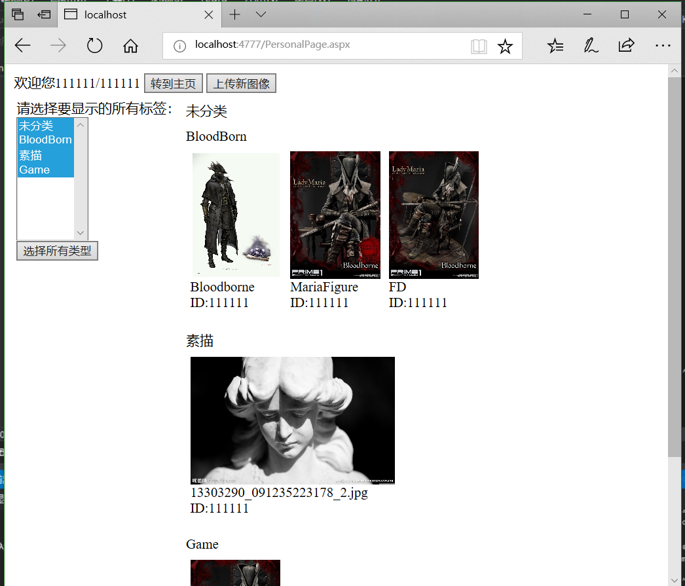

# 在线相册说明

---

## 数据库部分
### 有哪些数据库？
#### UserTable
保存用户注册信息。

构建表的Sql代码：
```sql
CREATE TABLE [dbo].[userTable] (
    [USER_ID]   VARCHAR (10)  NOT NULL,
    [USER_NAME] NVARCHAR (50) NULL,
    [PASSWORD]  VARCHAR (12)  NOT NULL,
    PRIMARY KEY CLUSTERED ([USER_ID] ASC)
);
```


列   |   说明
-----|---------
USER_ID |   用户ID，注册的时候由用户填写，一旦注册就不可更改，不可重复
USER_NAME   |   用户名，或者说昵称，不同用户的昵称可以重复，但是不能为空
PASSWORD    |   密码

#### ImageTable
保存图片的信息，服务器端，所有上传的图片都将会被重命名，使用统一的GUID加上对应图片格式的扩展名，
存储到一个固定的文件夹中，所有的图片都放在一起，而数据库则负责存储对应图片GUID的名称以及拥有这个
图片的用户ID。
图片ID和用户ID组成表的**主键**。

构建表的Sql代码：
```sql
CREATE TABLE [dbo].[ImageTable] (
    [IMG_ID]   VARCHAR (50)  NOT NULL,
    [USER_ID]  VARCHAR (50)  NOT NULL,
    [IMG_NAME] NVARCHAR (50) NULL,
    PRIMARY KEY CLUSTERED ([IMG_ID] ASC)
);
```


列   |   说明
-----|---------
IMG_ID  |   唯一标识一张图片的字符串，包括图片的原始扩展名，形如 **w84qer54654e6w5465r4e65.jpg**，每次上传的图片，其都会获得一个独一无二的ID
USER_ID |   拥有这张图片的用户ID
IMG_NAME|   图片的名字，用户可以修改这个名字为任何字符串

#### TagTable
保存标签的地方，标签信息分为标签ID和标签名，同上面一样ID一旦创建就不可更改，而标签名可以更改（*目前没有做更改标签名的功能*）。
标签ID由相应的代码自动生成，用户只需要关注标签名就可以了。

构建表的Sql代码：
```sql
CREATE TABLE [dbo].[TagTable] (
    [TAG_ID]   VARCHAR (50)  NOT NULL,
    [TAG_NAME] NVARCHAR (50) NOT NULL,
    PRIMARY KEY CLUSTERED ([TAG_ID] ASC)
);
```

#### ImgTagTable
图片标签记录数据库，每一位**用户**的每一张**图片**的每一个**标签**，作为一条记录。
而且仅记录ID值，三者共同组成表的**主键**。

构建表的Sql代码：
```sql
CREATE TABLE [dbo].[ImgTagTable] (
    [IMG_ID]  VARCHAR (50) NOT NULL,
    [TAG_ID]  VARCHAR (50) NOT NULL,
    [USER_ID] VARCHAR (10) NOT NULL,
    PRIMARY KEY CLUSTERED ([IMG_ID] ASC, [TAG_ID] ASC, [USER_ID] ASC)
);
```

列   |   说明
-----|---------
IMG_ID  |   图片ID
TAG_ID  |   标签ID
USER_ID |   用户ID

### 如何添加你电脑上的数据库来运行？
在VisualStudio中使用**SQL Server 对象资源管理**添加数据库和表，其中数据表的sql代码已经列在上面了，
直接复制到**数据表**的设计页面底下一更新就好了。  
总共有**四个表**要创建。  
然后复制这个数据库的**连接字符串**。  
找到解决方案中的这个C#文件：**OnlineAlbum\Helpers\BaseDataBase.cs**
在文件的开头找到这样一段代码：
```C#
/*!
    \brief 当前网站用到的数据库连接字符串，要改数据库的话，直接改这个字符串就可以了。
*/
private const string m_connectString = @"Data Source=(localdb)\MSSQLLocalDB;Initial Catalog=DBForASPCourseDesign;Integrated Security=True;Connect Timeout=30;Encrypt=False;TrustServerCertificate=True;ApplicationIntent=ReadWrite;MultiSubnetFailover=False";
```

用刚才的**连接字符串**替换**m_connectString**后面的内容。

---

## 页面部分
### 登陆页面

可以点击左侧按钮转到注册页面

### 注册页面
**用户名**就是**用户ID**，只能为数字和字母。
**昵称**可写可不写，可以是任何字符串，如果不写的话就是默认为**用户ID**。


### 个人页面
* 展示用户自己上传的图像，以及可以添加新图像 *(另外打开一个页面)*。
* 左侧可以选择显示过滤图像的标签 *（支持多选）*，也可以直接点击下面的**选择所有类型**，直接全选所有标签。  
* 右侧竖向排列，一个标签占一个横排区域，如果一个图片由**多个**标签，则这个图片会重复出现在多个标签区域内。
* 点击图片就可以打开对这张图片的编辑。



### 主页
* 显示所有用户的图片，界面和**个人页面**类似
* 右侧的**退出登陆**会登出用户，打开**登陆页面**
* **个人中心**按钮会打开个人页面
* 这个时候如果点击到用户自己的图片，同样可以打开编辑页面，但是如果点击到别人用户的图片，则只会刷新一下界面而已。


### 上传页面
重命名文本框可以由用户输入来重命名图片，如果为空，图片名默认为上传之前的文件名，**注意区分 图片ID 和 图片名**


### 编辑界面
功能：
1. 更换图像
2. 重命名图片
3. 删除图像
4. 添加、删除标签，标签名由用户随意输入

上面1-3点完成之后自动跳转到**个人页面**，编辑标签则会保留在当前网页继续操作。


---

## 嵌套页面布局
使用UserControl来复用界面。
### 单个图片的显示效果
**“OnlineAlbum\UserControl\SingleImageOverView.ascx”** 中定义了单个图片的显示效果。  
从上到下：
* 图片
* 图片名
* 用户ID


### 包含某一种标签的所有图像
复用上面的单个图片显示效果，在顶上面添加一个标签名，页面定义在 **“OnlineAlbum\UserControl\ImagePanel.ascx”** 中。


### 带有标签分类的布局
页面定义在 **“OnlineAlbum\UserControl\ImageSortPanel.ascx”** 中，是上面一种布局的再次嵌套，在左侧加上了标签选择列表，右侧显示多个标签面板。


